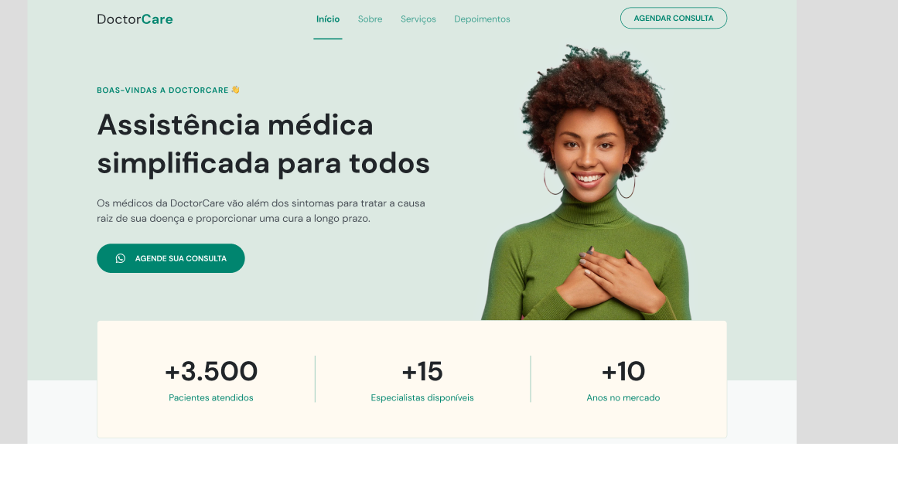

<h1 align="center">
  DoctorCare | For your  health wellfare👋
</h1>
<h1 align="center">
 
</h1>

 

## 💻 Project

📖 Generalist single Website for all purpose, make with basic Web Tools, but with solid concepts 🍏

## 🔨 Features

- [x] Whatsapp Button call
- [x] Information

## ✨ Technologies

- [x] Web Tools ( HTML/CSS )
- [x] Javascript
- [x] ScrollReview
- [x] Whatsapp link

## 🔖 Layout

Layout made with FIGMA by Jonas Milan
https://www.figma.com/proto/JUWgLEsAnI6wTVIXHvD2Bw/DoctorCare-(Community)?node-id=61%3A144&scaling=min-zoom&page-id=0%3A1&starting-point-node-id=61%3A144

# x DOCS

This is a [Web Page](https://developer.mozilla.org) with [ScrollReview](https://scrollrevealjs.org/).

## Getting Started

Donwload this project in github clone or zip download

## Learn More

For more web tools [MDN](https://developer.mozilla.org)

## Deploy on Vercel

The easiest way to deploy your Next.js app is to use the [Vercel Platform](https://vercel.com/new?utm_medium=default-template&filter=next.js&utm_source=create-next-app&utm_campaign=create-next-app-readme) from the creators of Next.js.

Check out our [Next.js deployment documentation](https://nextjs.org/docs/deployment) for more details.

Starred and enjoy!
